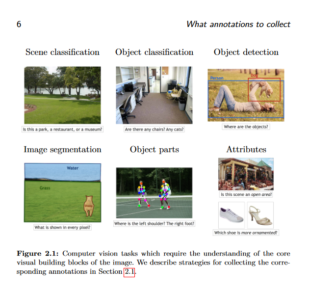

# INTRODUCTION
In this repo I've created 3 notebooks:
- [**testing_network_to_recognize_images.ipynb**](#testing_network_to_recognize_imagesipynb) - here I was epxloring and playing around some networks to recognize images on new dataset
- [**add_localizing_objects_dataset_prep.ipynb**](#add_localizing_objects_dataset_prepipynb) - here I was trying to gather dataset that not only class-labels but also border-box data. Result of this is dataset for next one:
- [**add_localizing_object_network.ipynb**](#add_localizing_object_networkipynb) - this one was created to expand functionality of xception to localize object on image

Also, there is some ideas for [**next steps**](#next-steps)

# testing_network_to_recognize_images.ipynb
## GOAL
The main goal is to pick some image data and test how well some network may reckognize it.
In my commercial job I have not practical application for this kind of networks and wanted to experiment with them a little.

Main goal:
- test how well perform network basing on pre-trained layers with known architecture vs creating something from scratch
- trying to analyze trainings and optymize network to improve results
- experiment a little with CNN layers and comparing different architectures implemented in papers

Assumptions:
- I don't wana spent much time on searching for good dataset - if picking just random will generates 100% corret answers i will try something harder, but if there will be room for improvements - i will stick to it
- I am assuming that picking networks trained on milions images and fine-tune them to small dataset shouldn't impact results much even if some smaple may overlap (I am picking different ouptuts so it need to re-learn final classes anwyway)
- I am expecting that data agumentation will be one of best thing to improve results and ignore this fact until very end of project to experiment with different approaches than "more data"
- I am expecting to relatively-easly allow network to find objects from another dataset with this method by using abilities to found features learnt during xception network was trained

I want to compare:
-    **xception_untrained** - Xception network without any training on the new dataset [baseline, probably the worst one]
-    **xception_short_train_unfrozen** - Xception trained for 5 epochs with all layers unfrozen  [it may either - break the existing knowledge or addept better]
-    **xception_short_train_frozen** - Xception trained for 5 epochs with base model layers frozen [i am assuming it may destroy existing knowledge but should be not limited as much]
-    **xception_fine_tuned_from_unfrozen** - Xception fine-tuned with additional epochs, starting from the short-trained model with unfrozen layers and then train with all unfrozen [may be good or bad, depends on previous results]
-    **xception_fine_tuned_from_frozen** - Xception fine-tuned with additional epochs, starting from the short-trained model with frozen layers and then train with all unfrozen [my default workflow in mind]

Then i just went with the flow and test a little more

## TABLE OF CONTENTS (and quick preview of its results)
**INTRODUCTION**

**BASIC PREPARATION**
- connect to drive (for colab), check if GPU available etc.
- Prepare new dataset to train splitted 75%/10%/15%
- Process images to work with network (without data augumentation for now)

**TRAIN FEW VERSIONS OF MODEL BASING ON XCEPTION**
- Test xception with replaced output layer but no traing **[test acc 22%]**
- Train more combinations (5 epochs with/without freezing base model, then 10 epochs with unfreezed)

**SUMMARISE PART**
- Analize metrics on last epoch **[best accuracy on test was 93.09%]**
- Analize accuracy/loss during each epoch for each model
	- Train was still improving with no change on validatoin that suggests overfitting **[reguralization may help]**
	- most has big difference between train/validation which suggests that **[model may lack samples to generalize patterns]**

**ADD REGURALIZATION TO IMPROVE MODEL:**
- Add dropout in between without replacing dense layer **[training was not progressing further and stays on 92.54% acc]**
- Add dropout and replace tuned dense layer with new (reset weights) **[progressing from scratch, after 10 epochs also getting 92.54% acc]**
- Continue training as loss was still improving **[This was still progressing, we get best for now 93,27% and loss was still improving]**
- Try DROPOUT and L2 REGURALIZATION **[New best one - 93,45%]**
- Try DROPOUT and L2 REGURALIZATION without locking layers **[92,54% - wrong direction]**

**MAKE CHANGES TO ARCHITECTURE**
- skip last 13 layers (Assuming network is to complex to generalize) **[New best - 93,81%]**
- skip last 63 layers (Assuming network is to complex to generalize) **[after 40 epochs only 83,09% but still improving relatively fast]**
- skip last 63 layers, try bigger LR (assuming model have not enough time to adapt) **[We are getting close - 91,81%]**

**TRY DIFFERENT ARCHITECTURE (if even cutting-out of half xception is still too complex)**
- inspired by beggining of of xception **[63,9% - looks like this is finally too simple]**
- some basic conv2d layers connected **[70.36% and no progressing]**

**TEST DIFFERENT EXISTING NETWORK ARCHITECTURE - AlexNet**
- test architecture from pytorch (layer sizes mismatch sizes from papers) **[74,36% and visible overfitting]**
- test architecture with correct layersizes and additional batchnormalization (generated by LLM after asking for it) **[72,18%]**

**EXPERIMENT WITH ALEXNET AS BASE TRYING TO IMPROVE GENERALIZATION**
- add bunch of dense layers to see what happen **[56,00% - we are getting much worse]**
- Add more Conv2D layers instead of dense with freezing base **[75,09% - a little improvement but difference between train and validation is just getting bigger]**
- Unfreeze and continue **[77,09% without progressing anymore]**

**FINAL XCEPTION TEST**
- Try XCEPTION architecture without picking pre-trained weights to compare its accuracy **[81,81%]**
- Test if XCEPTION with data augumentation may break 95% accuracy **[96,36% - just as expected, best of all tests]**

# add_localizing_objects_dataset_prep.ipynb
## CONSIDERED DATASETS

As i was exploring most commonly used datasets for this type of tasks was:

- PASCAL VOC - http://host.robots.ox.ac.uk/pascal/VOC/
	- expected company account to download
- ImageNet - https://www.image-net.org/challenges/LSVRC/ 
	- definetelly too large
	- xception was trained on ImageNet already so I wanted to choose something elese
- coco dataset - https://cocodataset.org/#home
	- have both, border boxes and segmentation
	- default way of downloading was broken, but using fiftyone is working

## WHAT IS HAPPENING IN THE FILE

Main goal is to prepare inputs and targets for xception

Specific steps to achieve that
- **DOWNLOAD DATASET** using fiftyone lib
- **LOAD DATASET** using fiftyone lib
- **EXPLORE DATASET** to determine how it looks like and how much filtering i should do before going to experiment with that
- **LIMIT NUMBER OF CLASSES** to boost speed of experiment (orginal dataset have 100k images with almost 1mln object instances)
- **LIMIT NUMBER OF DETECTIONS** - at this step i wanted to make working architecture to recognize position of one object. Passing all borders to model will only make it more confisung

# add_localizing_object_network.ipynb
## GOAL
Expand functionality of xception network to predict different things at the same time.
It requires modifying datasets, creating targets in different way and updating output layers.

## WHAT IS HAPPENING IN THE FILE
**LOAD DATASET ADN CHECK IT**
- check if it have expected variable ranges (f.e pixesl are described in -1 to 1)
- check classes sizes (if difference is large we may want to balance them)

**FIT MODEL WITH UNCHANGED ARCHITECTURE**
- Pick only 'label' targed from new dataset and fit model with unchanged architecture to check if data is prepared correctly

**FACE GPU MEMORY LIMITS WITH NEW DATASET**
- required implementation of DataGenerator as lowering batch_size was not enought

**ANALYZE DIFFERENT METRICS TO DETERMINE HOW MUCH UNBALANCED SETS AFFECTS RESULTS**
- Accuracy was 87% and f score at both was around 0.85-0.88 depending on class
- Difference between precision and recall was 10% which is closse to data unbalance (bigger class have more recall which suggests that model tends to "guess" this class more often when it is not sure)
- I've ignored this at the moment as i was more curious about marking objects at the moment

**PREVIEW TP, TN, FP, FN TO GET BETTER UNDERSTANDING OF OUTPUTS**
- In this case I've assumed "sandwitch" class as positive (it has label=1)

**IMPLEMENT POSITION RECOGNITION**
- Update architecture
- Freeze all layers that clasify images to dont break them at start
- fit model over both, 'label' and 'box_border' targets
- Analyze results
	- Accuracy was not changed
	- border mostly picks parts of objects, but seems prety random
- continue training with unfreezed layers
	- model accuracy improved a little
	- MAE decreased, but it is not really good metric to analyze this. It will be better to use IoU or mAP which i want to test in more advnced networks
- Test against own images

## CONCLUSION
- It was possible to implement localization 
- It's precision is rather shitty
- Main problem is in dataset that contains images with multiple instances of objects at the same time
- also, architecture of network is not allowing to predict 'NONE' if any of defined class is not in image
- These problems required addressing but i prefered to go rather ofer implementation than optimization here as I still want to implement more advanced solutions (recognition of multiple objects, image segmentation etc.) 

# NEXT STEPS
Depending on goal of project, we may need different dataset and different model responses. 

This may not be obvious and to pciture this, below is a part of https://arxiv.org/pdf/1611.02145 article that contains few examples what we may want to extract from images

## In this project we already covered:
- Scene/object classification (first of 3 files is doing exactly that)
- Beggining of object decetion
	- We have dataset with objects labeled with its borders
	- We implement detecting single object on image (even if our dataset was not prefect for that)

## For the future, it may be worth to:
- Implement network that will recognize more classes 
- Implement network that may detect multiple objects on the same picture and classify all of them (Probably we will start with YOLO architecture here)
- Implement network that will do image segmentation (assign pixels to classes)
- Implement model that will predict classes in hierarchical manner (f.e firstly determine if something is food or dog and then determine what kind)
